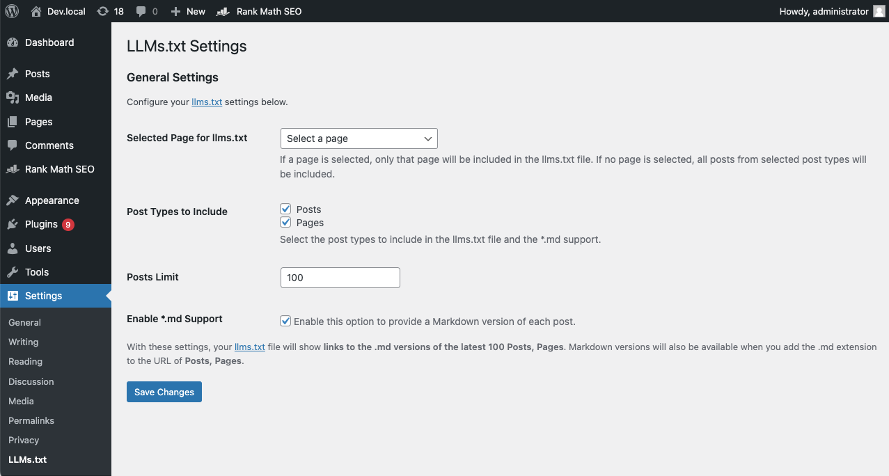
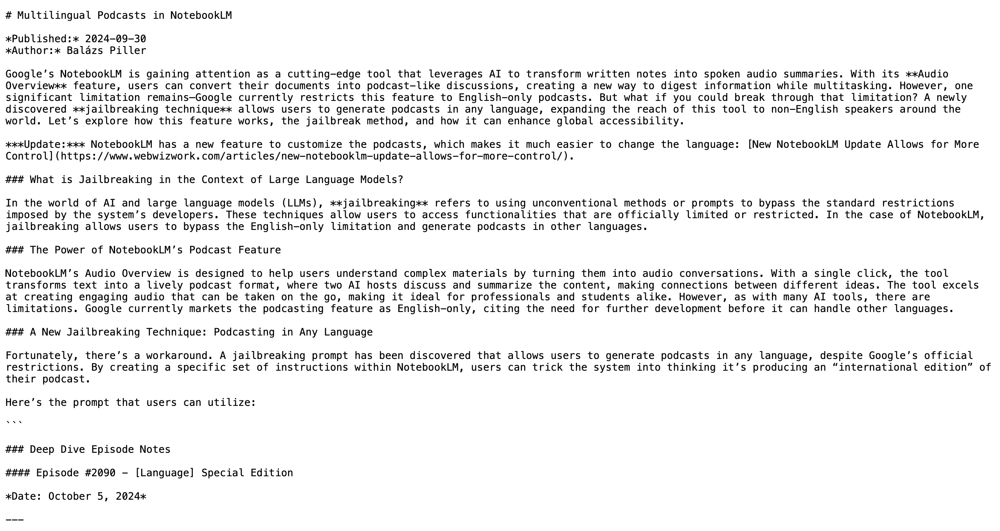

# LLMs.txt for WP

**Requires at least:** 5.0\
**Tested up to:** 6.7.1\
**Stable tag:** 1.0.0\
**Tags:** markdown, SEO, llms, content generation\
**License:** GPL v2 or later\
**License URI:** [https://www.gnu.org/licenses/gpl-2.0.html](https://www.gnu.org/licenses/gpl-2.0.html)\
**Contributors:** pbalazs

## Description

LLMs.txt for WP is a WordPress plugin designed to generate machine-learning-friendly content from your site. It automatically creates an `llms.txt` file that compiles key content in a standardized format, making your site ready for Large Language Models (LLMs), which can help make your content more discoverable and useful for AI tools and applications.

Additionally, this plugin allows you to easily access **Markdown versions of your posts** by appending `.md` to the post URLs.

### Key Features

- **Generate llms.txt**: Aggregate key content from your site into an easy-to-read format for machine learning models.
- **Markdown Support**: Generate Markdown versions of posts, suitable for LLMs and for those who prefer plain text or wish to share content in a lightweight format.
- **Fully Customizable**: Customize which page or posts should be included via the admin settings page.

## Installation

1. Download the plugin ZIP file from the [releases page](https://github.com/WP-Autoplugin/llms-txt-for-wp/releases).
2. Upload it to your WordPress site via the **Plugins** > **Add New** > **Upload Plugin**.
3. Activate the plugin through the **Plugins** menu in WordPress.

## Usage

1. **Configure Plugin Settings**: Go to **Settings** > **LLMs.txt Settings**.
2. **Select Content**: Choose which page or post types to include in the `llms.txt` file.
3. **Markdown Support**: Enable Markdown output by checking the option in the settings. Once enabled, add `.md` at the end of your post URLs to view the Markdown version.
4. **Access llms.txt**: Navigate to `https://yourdomain.com/llms.txt` to view the content compiled for LLM use.

### Admin Settings

- **Selected Page for llms.txt**: You can choose to include a specific page or all available posts.
- **Post Types to Include**: Select which post types should be included in the generated `llms.txt`.
- **Posts Limit**: Set a limit on the number of posts to include.
- **Markdown Support**: Enable or disable `.md` file extension to view posts in Markdown format.

## Frequently Asked Questions

### Why would I use this plugin?

If you want to make your website's content more accessible to machine learning models or share Markdown versions of your posts, this plugin is ideal. It helps you generate content specifically aimed at LLMs while also creating lightweight Markdown versions.

### How do I access the Markdown versions of posts?

Once Markdown support is enabled in the settings, you can add `.md` to the end of any post's URL (e.g., `https://example.com/your-post.md`).

### Can I control which posts are included in `llms.txt`?

Yes! The plugin can be configured to include specific post types and limit the number of posts included in the `llms.txt` file. You can also choose to include a specific page only.

## Screenshots

1. **Admin Settings Page** - Manage which content is included and enable Markdown support easily.

2. **Markdown Output** - Example of a blog post converted to Markdown.

## Demo

You can view a demo of the plugin in action on my blog at [WebWizWork.com](https://www.webwizwork.com/llms.txt).

## Changelog

### 1.0.0

- Initial release of LLMs.txt for WP.
- Added functionality to generate `llms.txt`.
- Added Markdown support for posts.

## License

This plugin is licensed under the GPL v2 or later. For more information, please see the [GNU General Public License](https://www.gnu.org/licenses/gpl-2.0.html).

## Contributing

We welcome contributions to this plugin. Please feel free to fork the repository, submit issues, or open a pull request.

## Support

If you need help or have questions, feel free to reach out through the plugin support page or [your website](https://example.com).

---

**Note:** This plugin utilizes the [league/html-to-markdown](https://github.com/thephpleague/html-to-markdown) library for HTML to Markdown conversion.
